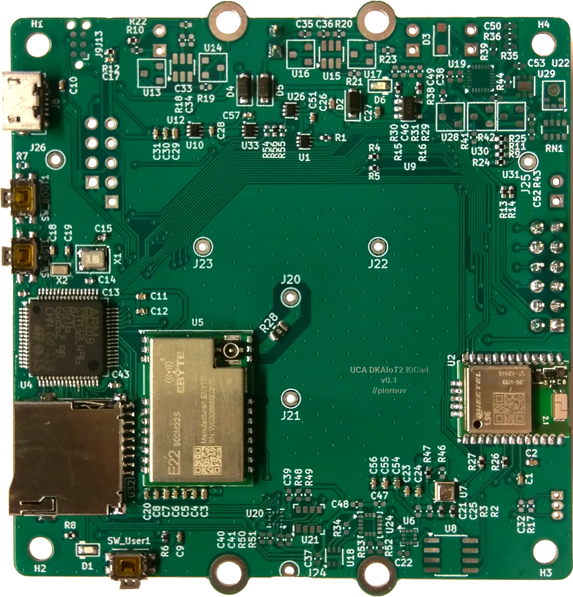
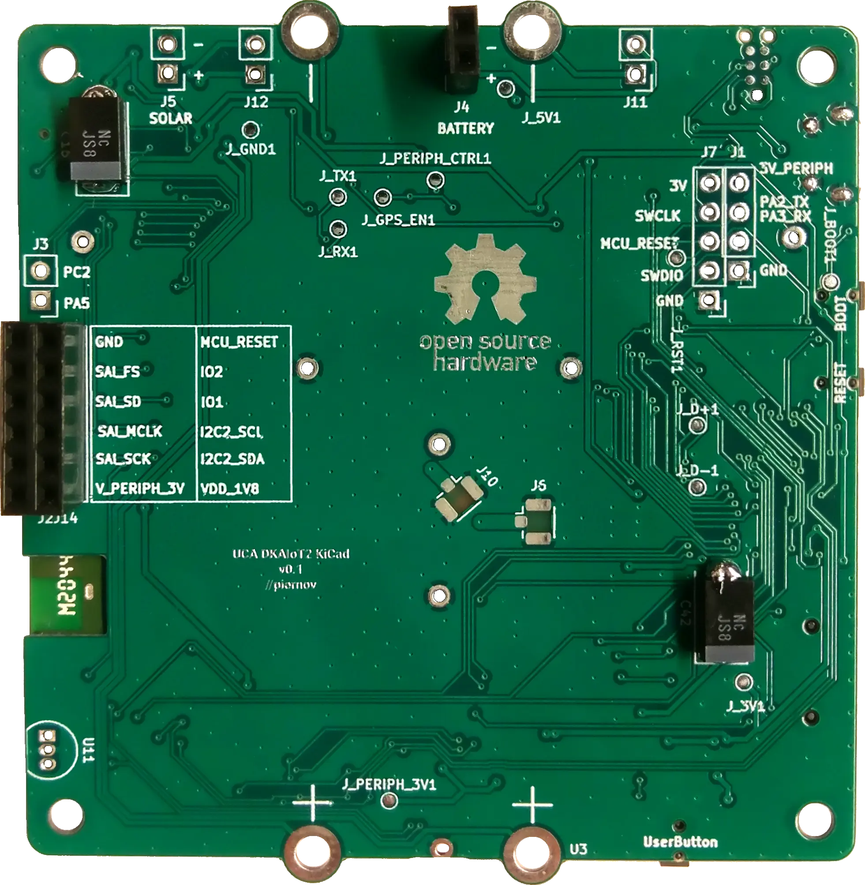

# Ambient DKAIoT Mainboard PCB

Mainboard PCB for the [Ambient project](https://github.com/LEAT-EDGE/ambient).

    
    

## Main features

- Microcontroller from the STM32L4 or STM32U5 families (LQFP-64 package, no SMPS)
  - STM32L496RG: low-power, Cortex-M4F 80 MHz, 320 KiB SRAM, 1 MiB Flash
  - STM32U595RI: ultra-low-power, Cortex-M33 160 MHz, 2.5 MiB SRAM, 2 MiB Flash
- LoRa modem (Ebyte E22-900M22S)
- GNSS module (Quectel L96-M33)
- Temperature, humidity and pressure (Bosch BME280)
- Micro-SD card reader

The design also provides empty footprints for several other sensors which are not populated in the Ambient variant:
- Light sensor (LITEON LTR-303ALS-01)
- MEMS microphone (Knowles SPH0645LM4H)
- Indoor air quality (Sensirion SGP30)
- Hall effect (Texas Instruments DRV5023AJQLPG)
- Barometer and altimeter (HopeRF HP203B)
- 3-axis accelerometer, 3-axis gyroscope, 3-axis magnetometer (TDK ICM-20948)
- 3-axis accelerometer, 3-axis magnetometer (STMicroelectronics LSM303AH)
- 3-axis accelerometer (Kionix KX023-1025-FR)
- 3-axis accelerometer (Kionix KXTJ3-1057)

## Project structure
- `/` (repository root): KiCad project
- `gerbers/`: Gerbers generated from the KiCad project
- `libraries/`: KiCad libraries of symbols, footprints and 3D models for components not found in the KiCad official repository
- `pdf/`: Schematics generated from the KiCad project
- `png/`: Screenshots of the KiCad 3D render
- `webp/`: Pictures of the actual board

## Firmware

### Firmware sources

Refer to <https://github.com/LEAT-EDGE/ambient-firmware-zephyr> for the new, Zephyr RTOS-based firmware (compatible with both STM32L4 and STM32U5),
and to <https://github.com/LEAT-EDGE/ambient-firmware-arduino> for the old Arduino-based firmware (not compatible with STM32U5).

### Updating the firmware

In order to flash the firmware, put the microcontroller in bootloader DFU mode by holding the BOOT button (right next to the USB port) and pressing the RESET button (next to the BOOT button), then releasing the BOOT button after a couple of seconds. Alternatively, you can hold the BOOT button while plugging the USB cable in, and releasing it after a couple of seconds.

[dfu-util](https://dfu-util.sourceforge.net/) can then be used to update the firmware.
It is called automatically by the `west flash` command when using the Zephyr-based firmware, or by the Arduino IDE's Upload button when using the Arduino-based firmware.

On Windows, for `dfu-util` to work properly, it is recommended to use the WinUSB driver. [Zadig](https://zadig.akeo.ie/) can be used to change the driver of the `STM32 BOOTLOADER` device to WinUSB.

On Linux, for a standard user to have access to the USB device, you may have to install a [udev rules file](https://github.com/LEAT-EDGE/ambient-firmware-arduino/blob/master/stm32dfu.udev.rules) in `/etc/udev/rules.d/`.

An SWD probe (e.g., STLINK V2 or V3) can also be used through the J7 debug header. Programming and debugging can then be performed using [OpenOCD](https://openocd.org/)

## Connectors and headers

### J1: UART

Exposes the `PA2` and `PA3` pins for the `USART2` peripheral of the microcontroller for debugging purposes.

Pinout:

| Pin   | Net           |
|-------|---------------|
| **4** | `V_PERIPH_3V` |
| **3** | `PA2_TX`      |
| **2** | `PA3_RX`      |
| **1** | `GND`         |

### J2J14

Main connector for the [audio capture and energy management daughterboard](https://github.com/LEAT-EDGE/ambient-pcb-audiopower).

Exposes the I2S bus (`SAI1B`), an I2C bus (`I2C2`), the 1.8V (`VDD_1V8`) and 3.0V (`V_PERIPH_3V`) peripheral supplies, 2 GPIOs (`PA10`, `PA15`) and the microcontroller reset signal (`MCU_RESET`, for reed switch reset trigger).

Pinout:

| Pin    | Net           | Pin    | Net            |
|--------|---------------|--------|----------------|
| **11** | `GND`         | **12** | `MCU_RESET`    |
| **9**  | `SAI_FS`      | **10** | `EXT_MIC_IO_2` |
| **7**  | `SAI_SD`      | **8**  | `EXT_MIC_IO_2` |
| **5**  | `SAI_MCLK`    | **6**  | `I2C2_SCL`     |
| **3**  | `SAI_SCK`     | **4**  | `I2C2_SDA`     |
| **1**  | `V_PERIPH_3V` | **2**  | `VDD_1V8`      |

### J3: ADC/DAC

Unused in the Ambient variant.

Exposes 2 GPIOs (`PA5`, `PC2`) that provides access to the microcontroller's ADC and DAC channels.

Pinout:

| Pin   | Net           |
|-------|---------------|
| **2** | `PC2_ADC`     |
| **1** | `PA5_DAC_ADC` |

### J4: BATTERY

Power input to the board and output of the USB charging circuit.

The [audio capture and energy management daughterboard](https://github.com/LEAT-EDGE/ambient-pcb-audiopower) connects to this header with its J3 connector.

| Pin   | Net     |
|-------|---------|
| **2** | `+BATT` |
| **1** | `GND`   |

### J5: SOLAR

Unused in the Ambient variant.

Power input to the charging circuit

Pinout:

| Pin   | Net     |
|-------|---------|
| **2** | `SOLAR` |
| **1** | `GND`   |

### J7: SWD

Exposes the SWD pins of the microcontroller for debugging purposes.

Pinout:

| Pin   | Net         |
|-------|-------------|
| **5** | `3V`        |
| **4** | `SWCLK`     |
| **3** | `MCU_RESET` |
| **2** | `SWDIO`     |
| **1** | `GND`       |

### J11: BATT1

Unused in the Ambient variant.

1st Li-ion cell connector, behind protection circuit.

| Pin   | Net         |
|-------|-------------|
| **2** | `+BATT1_IN` |
| **1** | `-BATT1_IN` |

### J12: BATT2

Unused in the Ambient variant.

2nd Li-ion cell connector, behind protection circuit.

| Pin   | Net         |
|-------|-------------|
| **2** | `+BATT2_IN` |
| **1** | `-BATT2_IN` |

### J20/J21/J22/J23: antenna header

Used to attach the [LoRa antenna mezzanine PCB](https://github.com/LEAT-EDGE/ambient-pcb-antenna).

| Pin     | Net       |
|---------|-----------|
| **J20** | `E22_ANT` |
| **J21** | `GND`     |
| **J22** | `GND`     |
| **J23** | `GND`     |

## Fabrication notes

### PCB

Standard 2-layer 0.8mm stackup:
- 2 layers (front/back),
- 0.8mm thickness,
- 1oz copper,
- FR-4 dielectric,
- HASL finish.

No special requirements, any solder mask and silkscreen color.

Gerbers are provided in the `gerbers/` directory but can be re-generated from the KiCad project.

### Assembly

Recommended automated assembly for top-side only.

Manual assembly for top side:
- J20, J21, J22 and J23 pins (through-hole), to be inserted or cut flush with the back side.

Manual assembly for bottom side:
- C16 and C42 capacitors (SMD),
- J2J14 and J4 connectors (through-hole).

## Testing

Currently, no testing process and firmware is provided. Proper operation of the board can be checked by running the Ambient application firmware.

Short checklist (non exhaustive):
- [ ] USB DFU bootloader detection
- [ ] USB DFU bootloader firmware programming
- [ ] Application firmware boot
- [ ] USB CDC-ACM logs
- [ ] LoRa modem initialization
- [ ] LoRaWAN join
- [ ] LoRaWAN send
- [ ] GNSS time synchronization
- [ ] BME280 temperature read
- [ ] SD card initialization and file write
- [ ] Daughterboard communication:
  - [ ] INA3221 initialization
  - [ ] INA3221 battery/solar current/voltage read
  - [ ] ADC3101 initialization
  - [ ] I2S initialization
  - [ ] I2S audio signal capture

## Acknowledgment

Original circuit design by [@nguyenmanhthao996tn](https://github.com/nguyenmanhthao996tn) in Altium.

The schematics and PCB have been re-designed from scratch in KiCad, while keeping the original circuit ideas, BOM, and component placement to be used as a drop-in replacement.

This project has received funding from [Université Côte d'Azur](https://leat.univ-cotedazur.fr/) and [CERN](https://home.cern/).
